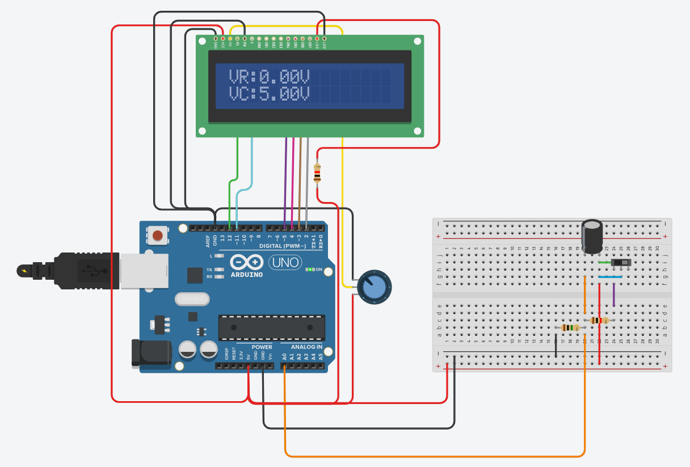
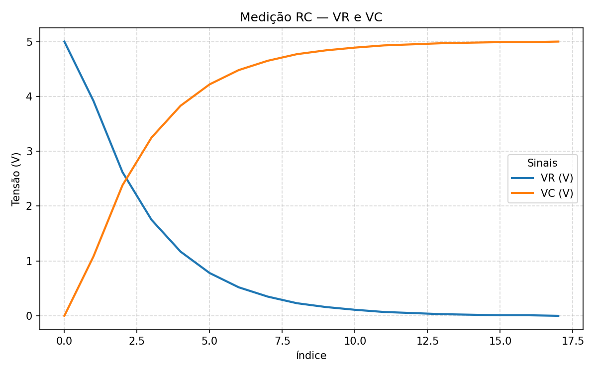

# Ponderada - Circuito RC

Projeto simples para observar a carga de um circuito RC.  
O Arduino lê a tensão no resistor (VR) no pino A0, calcula a tensão no capacitor (VC = 5 − VR) e mostra ambas em um LCD 16×2.  
Os valores medidos podem ser registrados em `dados.csv` e o gráfico é gerado por `grafico-codigo.py`.

<!-- Imagem do circuito centralizada -->

  

<!-- Explicação breve entre as imagens -->

  Em um circuito RC, as tensões VR (no resistor) e VC (no capacitor) se complementam: quando VC aumenta, VR diminui; quando VC cai, VR aumenta. A soma fica próxima à tensão de alimentação (≈ 5 V).

<!-- Imagem do gráfico centralizada -->

  

## Estrutura
- `circuito-codigo.ino`: lê A0, calcula VR/VC e exibe no LCD (atualização a cada 400 ms).
- `dados.csv`: arquivo com medições de VR e VC.
- `grafico-codigo.py`: plota VR e VC e salva a figura (`grafico.png`).

## Materiais
- 1x Arduino Uno (5 V)
- 1x LCD 16×2 (biblioteca LiquidCrystal)
- 1x potenciômetro (contraste do LCD)
- 1x resistor (R do circuito RC)
- 1x capacitor eletrolítico (C do circuito RC)
- Jumpers e protoboard

## Ligações
LCD (modo 4 bits, conforme `LiquidCrystal lcd(12, 11, 5, 4, 3, 2);`)
- RS → D12
- E  → D11
- D4 → D5
- D5 → D4
- D6 → D3
- D7 → D2
- VSS → GND | VDD → 5 V | RW → GND  
- VO (contraste) → pino central do potenciômetro (extremos em 5 V e GND)

Circuito RC
- 5 V — R — nó — C — GND
- A0 → nó entre R e C (mesmo GND do Arduino)

Observação: A leitura em A0 é interpretada como VR; então VC é calculado internamente como `5.0 − VR`.